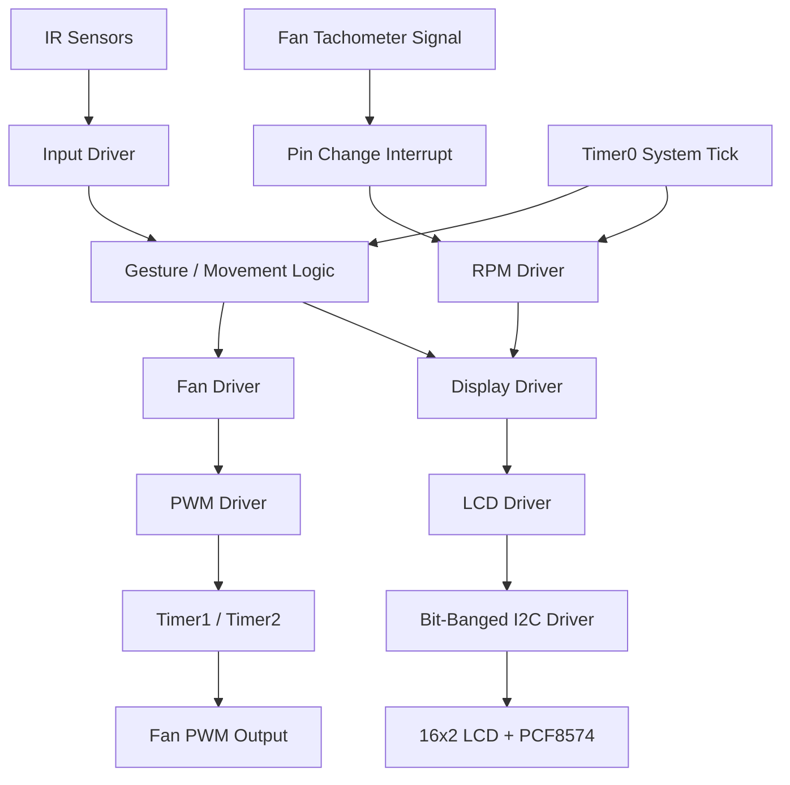

# FlyingFan

**FlyingFan** is a bare-metal embedded C project for an **ATmega328P-based smart ventilation system**. The system controls fan speed with hardware PWM, reads a tachometer signal to estimate RPM, displays live status on a 16x2 LCD, and uses four IR sensors for touchless gesture-style speed control.

The project was built without Arduino libraries. Most hardware access is handled through custom drivers for GPIO, timers, PWM, I2C, LCD output, RPM measurement, and input handling.

---

## Features

* **Bare-metal C on ATmega328P**

  * No Arduino framework or Arduino library dependency.
  * Uses AVR registers and custom drivers.

* **Touchless fan-speed control**

  * Four IR sensors are arranged as directional inputs: up, right, down, and left.
  * Sensor transitions are interpreted as motion around the fan-control interface.
  * Detected movement increases or decreases the fan PWM value.

* **Hardware PWM fan control**

  * Fan speed is controlled through a PWM output.
  * PWM duty cycle is represented as an 8-bit value from `0` to `255`.
  * The current implementation uses pin `D10` / `PB2` for PWM output.

* **RPM feedback**

  * A tachometer signal is counted using a pin-change interrupt.
  * RPM is recalculated periodically and smoothed using a short history buffer.

* **16x2 LCD status display**

  * Displays current RPM.
  * Shows a progress bar representing fan speed.
  * Uses an I2C LCD backpack interface.

* **Modular driver structure**

  * Separate modules for GPIO, timers, PWM, fan control, display, input, RPM, I2C, LCD, ADC, EEPROM, and interrupts.

* **Makefile-based build system**

  * Builds with `avr-gcc`.
  * Flashes with `avrdude`.
  * Includes host-side unit-test targets for selected drivers.

---

## Project Architecture



The main loop performs three jobs:

1. Reads the current active IR sensor.
2. Converts sensor transitions into a speed adjustment direction.
3. Updates RPM and LCD output at a fixed interval.

Interrupts are used for:

* `Timer0` compare match interrupt: millisecond system tick.
* Pin-change interrupt: tachometer pulse counting.

---

## Hardware Overview

### Main components

| Component                                   | Purpose                       |
| ------------------------------------------- | ----------------------------- |
| ATmega328P board, Arduino Nano or Uno style | Main microcontroller platform |
| 4x IR obstacle sensors                      | Touchless directional input   |
| PWM-controllable fan                        | Ventilation output            |
| Fan tachometer output                       | RPM feedback                  |
| 16x2 LCD                                    | User interface                |
| PCF8574 I2C LCD backpack                    | LCD communication interface   |
| External fan power supply / driver circuit  | Safe fan power and switching  |

> Do not power a fan directly from a microcontroller GPIO pin. Use a proper fan power source and a suitable transistor/MOSFET/driver stage when needed. Keep the fan ground and microcontroller ground common.

---

## Pin Mapping

| Function             | ATmega328P / Arduino-style pin | Notes                                |
| -------------------- | -----------------------------: | ------------------------------------ |
| PWM fan control      |                  `D10` / `PB2` | PWM output used by the fan driver    |
| RPM tachometer input |                  `PB3` / `D11` | Pin-change interrupt input           |
| IR sensor: Up        |                   `PD7` / `D7` | Active-low input                     |
| IR sensor: Right     |                   `PD6` / `D6` | Active-low input                     |
| IR sensor: Down      |                   `PD5` / `D5` | Active-low input                     |
| IR sensor: Left      |                   `PB0` / `D8` | Active-low input                     |
| Software I2C SCL     |                   `PD2` / `D2` | LCD backpack clock line              |
| Software I2C SDA     |                   `PD3` / `D3` | LCD backpack data line               |
| LCD I2C address      |                         `0x27` | Shifted in code for write operations |

---

## Build Requirements

Install the AVR toolchain:

* `avr-gcc`
* `avr-objcopy`
* `avrdude`
* `make`

---

## How the Control Logic Works

### Fan speed control

The fan speed is stored as a PWM value from `0` to `255`.

* Higher PWM value = higher fan speed.
* Lower PWM value = lower fan speed.
* Speed changes are clamped between `0` and `255`.

When the system detects a valid directional movement between IR sensors, it changes the PWM value in small steps.

### Gesture-style input

The four IR sensors are treated as positions around a circular interface:

```text
        Up
         0
Left 3       1 Right
         2
       Down
```

The firmware compares the current active sensor with the previous active sensor. Movement in one direction increases the fan speed, while movement in the opposite direction decreases it.

A timeout is used to reset movement momentum when the user stops interacting with the sensor ring.

### RPM measurement

The tachometer signal is connected to a pin-change interrupt. Each detected pulse increments a global pulse counter. Once per update interval, the firmware estimates fan RPM from the number of pulses counted during the elapsed time.

A small moving average is used to reduce noise in the displayed RPM value.

### LCD display

The LCD shows:

* Current RPM on the first row.
* Fan-speed progress bar on the second row.

The progress bar maps the PWM value from `0–255` to `0–16` LCD blocks.


